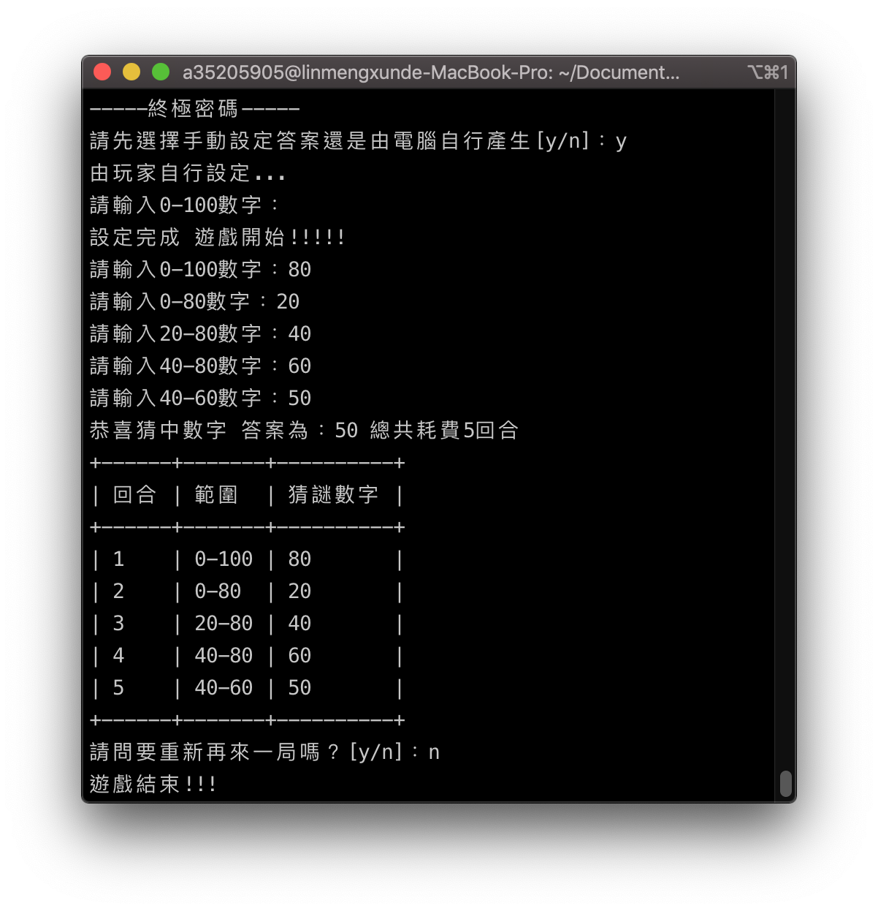

# da_vinci_code

> 猜題數字及答案為1-100整數

## 題目

1. 使用者選擇手動輸入答案或是電腦產生答案
2. 使用者輸入數字
3. 比對數字
    - 猜題數字大於答案：
        - 最大值為猜題數字
        - 進行下一回合
    - 猜題數字小於答案：
        - 最小值為猜題數字
        - 進行下一回合
    - 猜題數字等於答案：
        - 輸出答案
        - 遊戲結束
        

